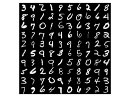
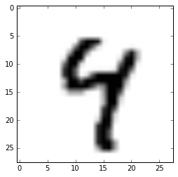

***

The MNIST dataset is a large dataset of handwritten digits; used primarily for the training of image processing systems.

Many researchers usually test the performance of their algorithms and  neural network implementations on this dataset.

```{r, echo=FALSE, fig.show='hold', message=FALSE, warning=FALSE, out.width="30%", results="asis"}

knitr::include_graphics("mnist_sorted.png")

```

***

## The Data

### What does the data look like?

```{python engine.path="C:\\Users\\Yanal\\Anaconda3\\python.exe"}
```

### Processing the Data

```{}
```

***

## The Activation/Classifier Functions

We are going to test and benchmark 3 different __*activation functions*__ or __*neurons*__ for our classifier net, the logistic sigmoid $f_1$, the hyperbolic tangent $f_2$, and the approximate hyperbolic tangent $f_3$.

$$
\begin{aligned}
f_1(x) &= \sigma(x) \\
f_2(x) &= \tanh(x) \\
f_3(x) &= 1.7159 \cdot \tanh(\frac{2}{3}x) \\
\end{aligned}
$$

```{r Comparison of Activation Functions}
f1 <- function(x) {
1 / (1 + exp(-x))
}

f2 <- function(x) {
2*f1(2*x) - 1
}

f3 <- function(x){
1.7159*f2((2/3)*x)
}

x <- seq(-10, 10, 0.01)

matplot(x,
cbind(f1(x),f2(x), f3(x)),
type="l",
lty = "solid",
col=c("#ec0928", "#008cba", "#cbcbcb"),
lwd = 4)

```

***

## Implementation in Code {.tabset}

### $\sigma(x)$

### $\tanh(x)$

### $1.7159 \cdot \tanh(\frac{2}{3}x)$

```{python engine.path="C:\\Users\\Yanal\\Anaconda3\\python.exe"}
import sys
print(sys.version)
```

***
